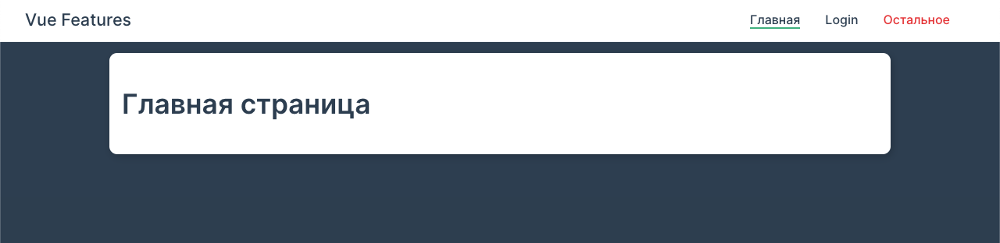

# vue (Some projects by practice)

## Project setup
```
npm install
```

### Compiles and hot-reloads for development
```
npm run serve:ui
```

### Compiles and minifies for production
```
npm run build
```

### Customize configuration
See [Configuration Reference](https://cli.vuejs.org/config/).

### Node version
14.17 / 16.15